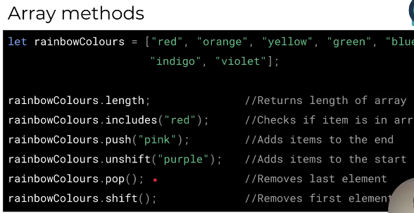

### Arrays 
- Javascript sunthax example:
```
let rainbowColours = ["red", "Orange", "Yellow", "green", "blue", "indigo", "Violet"];

rainbowColours[2] //yellow
rainbowColours[6] //violet

or 

console.log(`The first item in the rainbowCOlours array ${rainbowColours[0]}`);

```

- Trying to retrive a value thats outside the range of an array will return an undefined value i.e 
```
let rainbowColours = ["red", "Orange", "Yellow", "green", "blue", "indigo", "Violet"];

rainbowColours[7] //returns undefined
```

**__Array methods__**

- varrious array methods 
- various ways to manipulate data in an array 

**__Other ways to manipulate data in an array__**

```
let shoppingCart = ["Bread", "Meat", "Steak"]

<!-- To add items to the end of an array -->
shoppingCart.push("Weetbix")

<!-- To add items to the start of an array -->
shoppingCart.unshift("Coco Pops");

<!-- To remove the last item in an array -->
shoppingCart.pop();

<!-- To remove the first item in an array -->
shoppingCart.shift();

<!-- Splice(startPosition, quantityToRemove) -->
<!--  This function can remove a specific amount of items from an array, starting at a specific positon in the array -->
shoppingCart.splice(1, 1);

```

** the concat method allows us to combine two arrays into a new array 
```

let simpleColors = ["red", "Green", "Blue"];
let advanceColors = ["Gold", "Silver", "Bronze"];

let allColors = simpleColors.concat(advanceColors)

allColors returns
allColors // ["red", "Green", "Blue", "Gold", "Silver", "Bronze"]

```