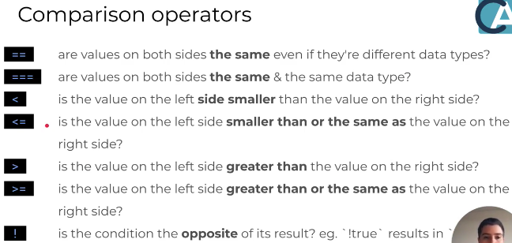

### control flow 
- Control flow is when one piece of code controls whether or not another piece of code is going to run, this is usually detrmined by a conditional statement.

**__Most common control statements__**
- if statements
- if else statements
- if elseif staements
- while statements
- switch statements 0r in ruby case statements
- for statements


**__Control Flow__**
- Javascript synthax example:
```
if(condition) {
    // a block of code to run if condition is met
}
```

**_Conditionals__**
```
let coinFlip = 'heads'

if(coinFlip == 'heads'){
    console.log("The coin landed with heads facing up!");
}

returns undefined
```

**_Comparing data types__**
- Javscript is whats known as a weakly typed language: meaning its variables can change thier data type, you can compare diffrent types of data together.
- If the values of two camparions are the same but the data types are different, when compary the 2 values jaavsript will perform the conversion for us...

```
let randomNumber = "4"

if(randomNumber == 4){
    console.log("the number was equal to 4!");
}

```

**_Using tripple equals or strict equals__**

```
let randomNumber = "4"

if(randomNumber === 4){
    console.log("the number was equal to 4!");
}

```
- This will return nothing, as the tripple qual sign does strict comparisons..
- Tripple euqal or strict equal requires both pieces of the data to be of the same value and type.


**_True and False__**
- Evaulates if the piece of code returns true or false 

```
console.log(1 == 1);
//true

console.log(1 == 2);
//false
```

**_6 Falsey values in javascript__** 
1. False
2. 0
3. " "
4. NaN
5. null
6. Undefined

- Anything thats not falsey is truthy in javascript

**__Comparison operators__**


**__&&__**
- Javascript represents 'and' with '&&'
- You need both sides to be true

```
if('0' == 0 && 'hello' === 'hello'){
    console.log("two conditions both are met!");
}

this is true so the could will log 
"two conditions both are met!"
```


**__||__**
- only one side of the comparision needs to be true to run the code

```
if(0 < 10 || "banana" == 4) {
    console.log("Only one condition was met, but the OR operator says that's good enough!");
}

- because one side of the or operator is true the code logs
"Only one condition was met, but the OR operator says that's good enough!"
```


### Part Two

'if' isn't enough...

**__else__**
- Instead of using if statements, you better off grouping groups of code that go together together.
- Using and else statement afetr your if statment will provide an alternate outcome for the code 

```
let password = 'Password123';
let submittedPassword = 'Password1';

if(password == submittedPassword){
    console.log("user submitted the correct password, they can log in!");

} else{
    console.log("User entered the incorrect passord. Please try again!");
}


```

**__else if__**
- great use of an else is statement
```
let newPassword = 'Password123';

if(newPassword[0] != newPassword.toUpperCase()[0]) {
    console.log("Password does not start with a capital letter!");

} else if (newPassword.toLowerCase().includes('password')) {
    console.log("Password should not use easy-to-guess words!");

} else {
    console.log("Password is okay!");
}


```

**__Switch (also known as a case statment in ruby__**
- More simple method of checking mutliple conditions

```

let favouriteColor = 'pink'

switch(favouriteColor) {
    case "red":
        console.log("The user's favoruite color is red");
        break;

    case "Orange":
        console.log("The User's favoruite color is orange!");
        break;

    case "Yellow"
        console.log("The User's favourite colour is YELLOW!")
        break;

    default:
        console.log("The user's favourite colour is not in the rainbow!");
        break;
}

- The switch is able to jump to the relevant case as oppose to go through each case 
- This saves a lot of time when computing the code
```