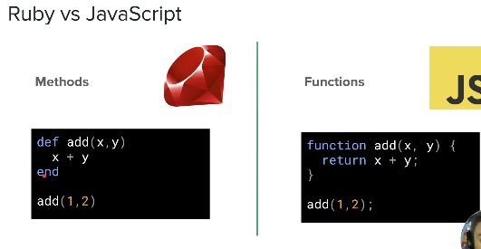
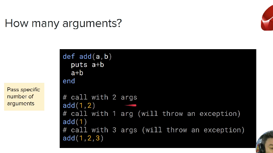
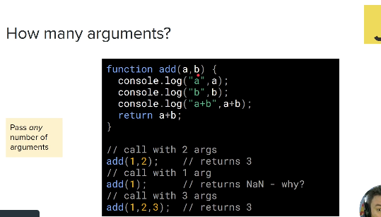
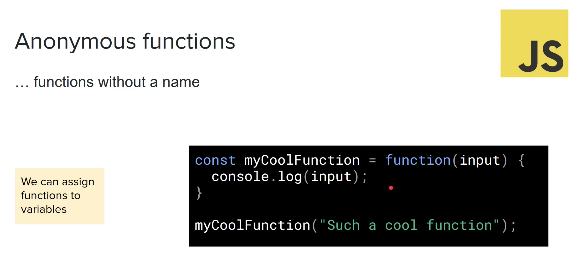
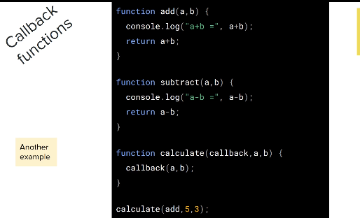

### JS functions

**__WHat is a function__**
- Similar to a ruby method
- PRocedure 
- set of statements that perfom a task

**__Ruby vs Javascript__**



- Ruby uses the def key word to create a method
- In javscript we use the function keyword to create a function
- In ruby we don't need to write return statement to return the method
- In JS we need a return staement for the function to be excuted and somethign to be returned.
- Prior to ES6 it was requeired to use semi coloons when eneded a code in JS, now its not needed.


**__How many arguments?__**

#### Ruby:



- In Ruby when a method is defined with a certain amount of arguments, when calling the method we must use the same amount of argmenst as used to difine the method.


#### Javascript:


- If you call the function with only 1 arguement, it returns NaN, not a number.. the first argument 'a' is being met with the function call but the second argument 'b' is retunign undefined, which is not a NaN(not a number).
- If you call the function with more than 2 arguments, or more agurments that specified when creating the function - it returns the function as if only the specific aruguments where enetred in the call and ignores the additional arguments.

**__What we can do instead...__**
- We can create a function without any defined number of arguments, and enter the agruments in during the fucntion call

```

function myArgs(){
    console.log(arguements);
}

myArgs(1, 2, 3, 4);

```

**__Another method...__**

- Write a function with a minimal amount of arguments specified 
- Using args to contain the rest of the arguments...

```

function myOtherArgs(x, y, ...args){
    console.log(x, y, args);
}

myOtherArgs(11, 22, 33, 44, 55, 66);

```

- 11 would go into x
- 22 would go into y
- and 33, 44, 55, 66 would go into the args array


**__First-class functions__**
- Functions that are treated like other objects in that language..
- functions can be stored inside a vriable and treated like other objects

They can be:
- assigned to variables
- nested in other objects
- passed as parameters
- returned from other functions 

** This allows us to do some really powerful things


**__Anonymous functions__**
- Functions without a name
- In Ruby when defining a function wwe must give it a name...
- In javascript that is not the case, we can create a function that doesn't have a name..



- the function in this case is annymous and is past intp the vairable 'myCoolFunction'.

another exampled:

```
const myArray = [1, 2, 3];
const myArrayIncremented = myArray.map(
    function(item) {
        return item + 1
    }
);

```

**__Javascript ES6 offers us the fat arrow function__**

```

const myCoolFunction = (input) => {
    console.log(input);
}

myCoolFunctions("such a cool function");

```

**__Regular synthax vs fat arrow(arrow function) synthax__**

```
// Regular synthax
let multiplier = function(x, y) {
    return x * y;
}

vs.


// fat arrow
let multiplier = (x, y) => x * y;

```
- anything after the arrow function is returned without writing the return statement
- If theres only a single statement in the body you don't require the gjavascript bracces as seen in the fat arrow example


**__Callback functions__**

- Any function that is passed as an arguement to another function, and which is invoked by that other function....



- In this example the argunment callback is treated like a function withn the calculate function, using arguement a, and b as its own argument.
- When calculate is called, the callback arguement is treated as a placehilder for the add or subtract function which then calls the previouse defined functions on the script.